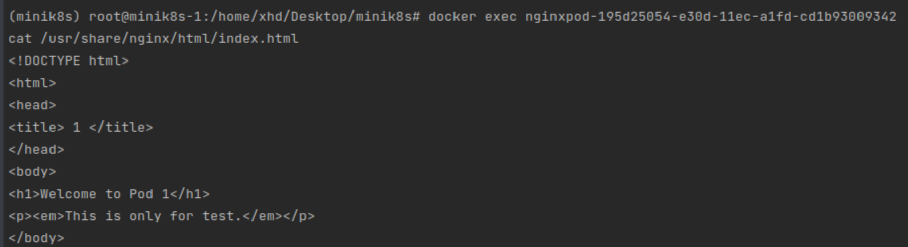
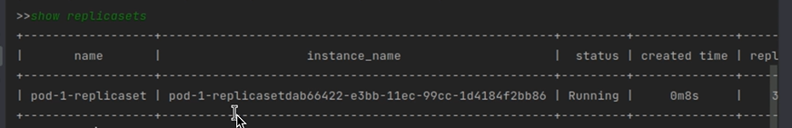
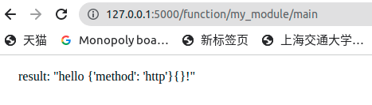

# Minik8s

成员

- 鲍辰 @ [Kami-code](https://github.com/Kami-code)
- 徐惠东 @ [WilliamX1](https://github.com/WilliamX1)
- 刘一翔 @ [liuyixiang42](https://github.com/liuyixiang42)

感谢 **赵子铭** 助教和 **柳清源** 助教在本项目开发过程中的指导与帮助。

>  本项目中提及的所有视频演示均可在 [Google Drive](https://drive.google.com/drive/folders/1WIHG2nCDOIMy4DTylEe37e8E_3EXKwk6?usp=sharing) 中观看和下载。

**Minik8s 是一个类似于 [Kubernetes](https://kubernetes.io/) 的迷你容器编排工具，能够在多机上对满足 CRI 接口的容器进行管理，支持容器声明周期管理、动态伸缩、自动扩容等基本功能，并且基于 minik8s 实现了 Serverless 平台集成。**具体要求可以参考以下实验文档。

- [Minik8s实验-基本要求](./doc/Minik8s实验-基本要求.pdf)
- [Minik8s实验-验收指南](./doc/Minik8s实验-验收指南.pdf)

## 目录

- [总体架构和软件栈](#总体架构和软件栈)
  - [总体架构](#总体架构)
  - [软件栈](#软件栈)

- [分工和贡献度](#分工和贡献度)

- [开发过程说明](#开发过程说明)
  - [CI/CD](#CICD)

- [目录](#目录)

- [安装](#安装)

- [配置](#配置)

- [目录结构](#目录结构)

- [运行逻辑](#运行逻辑)

- [验收答辩](#验收答辩)
  - [部署多机](#部署多机-minik8s)
  - [实现 Pod 抽象，对容器声明周期进行管理](#实现-pod-抽象对容器声明周期进行管理)
  - [实现 Service 抽象](#实现-Service-抽象)
  - [实现 Pod ReplicaSet 抽象](#实现-Pod-ReplicaSet-抽象)
  - [动态伸缩（auto-scaling）](#动态伸缩auto-scaling)
  - [DNS 与转发](#DNS-与转发)
  - [容错](#容错)
  - [支持 GPU 应用](#支持-GPU-应用)
  - [Serverless](#Serverless)
    - [第一个思路（废弃）](#第一个思路废弃)
    - [第二个思路（目前实现，助教推荐）](#第二个思路目前实现，助教推荐)
    - [Serverless DAG的支持](#Serverless-DAG的支持)

- [参考资料](#参考资料)

## 总体架构和软件栈

### 总体架构

Minik8s的架构视图如下，整体上参考了课上所提供的minik8s best practice的架构，可以分成了用户空间、控制面和worker节点三块。


在用户空间中，我们提供了三个用户可执行的脚本，适应用户的不同需求。这三个脚本最终都会向api server发出请求，api server根据相应的逻辑进行调度和转发。我们提供了大量的controller来监控对应的状态。对于kubelet的请求，api server会转发到对应的worker。
在多机方面，每个worker都会配置flannel，由flannel打通多机的ip分配和转发。

### 软件栈

Minik8s的软件栈如下图所示，整个minik8s基本上采用python语言实现。


## 分工和贡献度

| 姓名   | 分工                                                         | 贡献度 |
| ------ | ------------------------------------------------------------ | ------ |
| 鲍辰   | 组长，安排任务。主要负责ReplicaSet、Auto-scale、Serverless部分的实现和测试。 | 35.33% |
| 刘一翔 | 主要负责各组件的基础实现，交我算GPU部分和CICD的配置和调试。  | 29.34% |
| 徐惠东 | 主要负责Pod、Service、多机、网络、DNS部分的实现和测试。      | 35.33% |

## 开发过程说明

gitee仓库地址：https://gitee.com/Leimak/minik8s

仓库的分支记录详见下图和gitee仓库统计数据，master主分支用来发布，我们定期将稳定版本合入主分支中。其余分支，如`network-xhd`、`apiserver-bc`、`CICD-lyx`都是实现并测试某个具体功能的分支。 


项目测试流程分为代码走查和同行审查。在每周组会中，开发功能的组员被要求向其余两位组员逐条讲解代码并描述功能的设计、框架、实现思路。其余两位组员对其中的细节和可能存在的问题进行质询，从而保证软件质量。

而同行审查主要是在分支合并的过程中，要求指派另一名组员作为审查人员和测试人员，从而对功能的实现和BUG进行进一步的测试和检查，提高软件质量。


### CI/CD

本项目采用持续集成和持续部署框架，架构为gitee go架构，布署在gitee：Kami-code / Minik8s仓库。主要流水线包括`BranchPipeline`，`PRPipeline`，`MasterPipeline`。


`BranchPipeline`流水线主要包括编译和发布，用来维护分支代码


编译对象为对应分支代码，内容包括python构建和上传制品，构建过程在gitee镜像中更新pip工具，换源为https://pypi.tuna.tsinghua.edu.cn/simple源，注意，在先版本gitee镜像中存在setup tool无法正常使用导致编译不通过的情况，故需要更新setup tool，之后需要运行/sources/rabbitma-install.sh安装rabbitma组件并根据requirements文档安装项目相应依赖，最后运行run.sh


run.sh运行逻辑为并发运行master节点的api_server.py  node_controller.py  garbage_collector.py  replica_set_controller.py  service_controller.py  dns_controller.py  以及worker节点的kubelet_flask.py，记录其进程pid，在其正常运行4s后根据记录的pid将其关闭。

上传制品产物名为默认BUILD_ARTIFACT，制品名为默认output，基于build_python。


发布则根据上传制品名发布。


上传制品和发布均采用gitee go默认版本格式。

`PRPipeline`流水线主要包括编译，用来维护pull request后的分支代码


编译对象为合并后的分支代码，编译内容同BranchPipeline编译。

`MasterPipeline`流水线主要包括编译和发布，用来维护master分支的代码，以master分支为对象的pull request也会触发MasterPipeline。


编译对象为master分支代码，编译和发布内容同BranchPipeline。


## 安装

根据 [创建云主机](https://jcloud.sjtu.edu.cn/document/detail.html?id=747) 创建云主机。

根据 [绑定浮动 IP](https://jcloud.sjtu.edu.cn/document/detail.html?id=753) 绑定校园网，才能访问外网。

根据 [搭建 Ubuntu 可视化界面](https://jcloud.sjtu.edu.cn/document/detail.html?id=1245) 搭建云主机可视化界面。

我的云主机是：


1. 前往上海交通大学软件授权中心 [JetBrains All in One](http://lic.si.sjtu.edu.cn/Default/softshow/tag/MDAwMDAwMDAwMLGedqE) 选择 Linux 的版本下载。（最好直接在虚拟机里下）
2. 然后下载 `Pycharm Professional` 并根据 [JetBrains（在线授权版）安装和授权流程](http://lic.si.sjtu.edu.cn/Default/huatishow/tag/MDAwMDAwMDAwMLJ4iqE) 激活。
3. 安装 [Anaconda](https://docs.anaconda.com/anaconda/install/linux/)。
4. 安装 [Docker](https://docs.docker.com/engine/install/)

## 配置

1. 配置 `python` 环境，并设置 `conda` 默认环境为 `minik8s`。

```bash
$ conda create -n minik8s python=3.8
$ conda activate minik8s
$ vim ~/.bashrc # 在最后加入 conda activate minik8s
$ source ~/.bashrc
```

2. 拉取项目。

```bash
$ git clone https://gitee.com/Leimak/minik8s
$ cd minik8s
$ git checkout -b master origin/master
```

2. 安装 `python` 包。

```
$ pip uninstall protobuf
$ pip install -r requirements.txt
```

3. 退出 `root` 模式，用 `sudo` 方式打开 `pycharm`。

```bash
$ cd ~/.local/share/JetBrains/Toolbox/apps/PyCharm-P/ch-0/221.5591.52/bin/
$ sudo ./pycharm.sh
```

4. 配置安全组。

	添加网段进出口规则，防止网络请求被挡。如 `192.168.0.0/16`，`172.17.0.0/16`，`20.0.0.0/8` 的入口和出口。

## 目录结构

- `/.workflow`：CI/CD 配置文件。
- `/doc`：项目文档
- `/helper`：全局共享的参数和函数。
	- `const.py`： 全局共享的常数，包含一些文件路径。
	- `utils.py`：全局共享的工具函数，主要包含修改 `iptables` 条目的函数。
	- `yaml_loader.py`：用于加载 `yaml` 类型文件。
- `/master`：master 节点相关。
	- `/dns`：Dns 通过 Nginx 服务进行转发
		- `/nginx`
			- `/conf`：映射到 Nginx 容器中 `/etc/nginx/conf.d/`，在 Dns 创建时生成 `*.conf` 文件。
			- `/html`：映射到 Nginx 容器中 `/usr/share/nginx/html/`，在 Dns 产股
			- `/log`：映射到 Nginx 容器中 `/var/log/nginx`，生成报错日志，方便调试。 
		- `dns-nginx-server-replica-set.yaml`：Nginx 的基本信息 yaml，如底层有几个 Pod。
		- `dns-nginx-server-service.yaml`：Nginx 服务的基本信息 yaml，如该服务的虚拟 ip 地址和暴露的端口等。
	- `api_server.py`：minik8s 的 `api server`，使用 `Flask` 实现网络间通信，使用 `Etcd` 实现持久化存储。
	- `dns_controller.py`：minik8s 的 Dns 处理器，负责创建用户上传的 Dns 以及后续的更新和删除等。
	- `etcd_controller.py`：minik8s 用作容错的 etcd 守护进程。
	- `garbage_collector.py`：minik8s 的垃圾收集器，负责回收调度失败的 Pod。
	- `node_controller.py`：minik8s 的 Node 处理器，负责添加、删除节点等。
	- `replica_set_controller.py`：minik8s 的 Replicaset 处理器，负责创建、分配调度、删除用户上传的 ReplicaSet。
	- `serverless.py`：minik8s 的 Serverless 实现逻辑。
	- `service_controller.py`：minik8s 的 Service 处理器，负责创建用户上传的 Service 以及后续的更新和删除等。
- `/userland`：用户相关。
	- `/final_check`：期末答辩专用，包含一些用于演示的 `yaml` 文件。
	- `/frontend`：用于演示 Serverless 的前端。
	- `/gpu`：minik8s 的 GPU 支持部分。
	- `/parameters`：用于期末答辩演示的 GPU 的 yaml 文件参数。
	- `/user_serverless_scripts`：GPU 的加法和乘法脚本。
	- `/yaml_default`：用户自定义的 `yaml` 文件。
	- `kubectl.py`：minik8s 的用户交互命令行。
	- `kubectl_gui.py`：minik8s 的用户图形化交互界面，主要用作选择 `yaml` 文件上传。
- `/worker`：worker 相关。
	- `/HPA_test_docker` 
	- `/gpu`
	- `/multi_machine` 
		- `/configs`：`flannel` 的配置文件，可用作设置全局分配 `ip` 的网段，默认是 `20.20.0.0/16`
		- `/etcd`：做持久化存储所用的本地 `etcd`。
		- `/scripts`：一些 `shell` 脚本，主要用作 `kubelet_flask` 启动时配置 `flannel` 和 `docker`。
	- `/nodes_yaml`：用户定义的 `node` 信息的 yaml 文件。
	- `/sources`：部分资源。
	- `entities.py`：部分抽象类。
	- `kubedns.py`：用作 Dns 与转发的工具函数。
	- `kubelet_flask.py`：参考 k8s 的 kubelet，用作一键开启 worker 的函数。
	- `kubeproxy.py`：用作 Service 的工具函数。
- `requirements.txt`：项目依赖包。
- `run.sh`：CI/CD 运行脚本。

## 运行逻辑

运行解耦成主从节点的模式，且这个主从节点不限定于虚拟机，而是一种逻辑上的概念，即一台主机可能同时成为主节点和从节点。

在主节点上我们需要运行 `/master/api_server.py` 负责与各组件交互，运行 `/master/replica_set_controller.py` 负责处理 `ReplicaSet` 的请求，运行 `/master/service_controller.py` 负责处理 `Service` 的请求，运行 `/master/dns_controller.py` 负责处理 `Dns` 的请求，运行 `/master/garbage_collector.py` 负责回收请求失败的垃圾信息。

在从节点我们仅需要运行 `/worker/kubelet_flask.py` 负责处理主节点发来的请求即可。可以同过运行 `/userland/kubectl.py` 与集群通过命令行进行交互。

这种主从节点的设置让多台主机（不仅限于 2 台）共同组成一个集群，变得非常容易。

## 验收答辩

注：以下截图不一定与视频中完全一致，是因为每次运行时分配的 ip，内存占用等略有不同，可以供参考。

### 部署多机 minik8s

如何让 worker 加入 minik8s 集群？如何分配全局唯一的 ip ？如何连通多台主机间的网络通信？这些都是部署多机 minik8s 的关键问题所在。具体地，我们使用 Flask 进行网络通信来实现 worker 节点与 master 节点之间的消息传递，使用 Flannel + etcd 来实现多台主机上分配给 Pod 的 ip 地址是全局唯一的。

视频演示是 [1-Node.mp4](https://drive.google.com/file/d/1OrlWpDiY6zEPDTesxSbV6EwUqZNK9XdJ/view?usp=sharing)。

> 演示对 Node 抽象进行配置和操作的流程与运行情况。
> - 演示配置文件时，需演示自行设计的 Node 配置文件相关接口，并简述各字段含义。
> - 演示运行状况时，需演示如何通过 minik8s 的命令行接口（后文用 kubectl 代称）的相关命令，将全新的计算节点添加到 minik8s 的集群中，并演示如何利用 kubectl 的接口获得 Node 的状态。
> - 整个演示集群中应至少包含两台计算节点，一台运行 minik8s 的管理程序和 minik8s 所部署的实际容器，另一台则只运行 minik8s 所部署的实际容器。

在本次答辩时，我们使用助教提供的 `jCloud` 云虚拟机，其中 `minik8s-1` 作为主节点+从节点，而 `minik8s-2` 仅作为从节点。


| 节点类型 | 主机名称 | 内网 IP | 浮动 IP |
| :--: | :--: | :--: | :--: |
| master + worker | minik8s-1 | 192.168.1.12 | 11.119.11.120 |
| master | minik8s-2 | 192.168.1.5 | 11.119.10.16 |

master 节点的配置文件 `/worker/multi_machine/nodes_yaml/master.yaml` 如下，解释见注释。 

```yaml
ETCD_NAME: etcd  # etcd 名称, --name etcd
IP_ADDRESS: http://10.119.11.120  # etcd 运行的浮动 ip
ETCD_INITIAL_CLUSTER: etcd=http://10.119.11.120:2380  # etcd 初始化 cluster
ETCD_INITIAL_CLUSTER_STATE: new  # etcd 状态，我们的 etcd 只在 master 上跑，所以始终是 new
API_SERVER_URL: http://192.168.1.12:5050  # etcd 的 api server 所以网址，用于与 worker 节点进行网络通信
```

worker 节点的配置文件 `/worker/multi_machine/nodes_yam/worker1.yaml` 如下，解释见注释。

```yaml
MASTER_ETCD_CLIENT_URL: http://10.119.11.120:2379  # master 的 etcd 运行 ip
IP_ADDRESS: http://10.119.11.120  # worker 的浮动 ip，在另一台 worker 上为 http://10.119.10.16
API_SERVER_URL: http://192.168.1.12:5050  # master api server 的 ip
WORKER_PORT: 5051  # worker 用于与 master 节点通信的端口
```

在运行前我们可以运行 `/worker/multi_machine/scripts/clean-shell.sh` 来清理系统中可能残留的 `etcd`，`flannel` 和 `docker` 进程。


确保没有残余相关进程后，我们先在 minik8s-1 上运行 api server，如下图显示 master 对本机运行在 `127.0.0.1:5050`，对其他机器运行在 `192.168.1.12:5050`，则代表 api server 运行成功。

```shell
$ python3 ./master/api_server.py
```


然后我们分别在两台虚拟机上运行 `kubelet_flask.py` 并将配置文件作为参数传递进去。可以看到两个 worker 分别运行在各自机器上的 `5051` 端口，即在 Node 的配置文件中的 `WORKER_PORT`，就算加入集群成功。

```shell
$ python3 ./worker/kubelet_flask.py worker1 # minik8s-1 上运行
$ python3 ./worker/kubelet_flask.py worker2 # minik8s-2 上运行
```


我们运行 `/userland/kubectl.py` 来通过命令行与集群进行交互，并通过 `show nodes` 命令来获得 Node 的状态，包括 Node 唯一标识符 `name`，运行状态 `Running`，运行 ip `working_url`，所有的虚拟内存 `total_memory` ，内存使用率 `memory_use_percent` 和 cpu 使用率 `cpu_use_percent` 信息。

```shell
$ python3 ./userland/kubectl.py
>>> show nodes
```


至此多机部署就已经全部完成了。

### 实现 Pod 抽象，对容器声明周期进行管理

Pod 作为多个 Docker Container 的集合体，是 minik8s 的最小调度单位，因此，我们设计了 Pod 类来更加清晰地阐明和存储 Pod 的信息，采用 Python Docker SDK 来启动具体的容器。在网络方面，我们为每个 Pod 都额外启动一个 pause 容器，其他所有用户自定义的容器都与它共享网络栈。

视频演示是 [2-a-Pod.mp4](https://drive.google.com/file/d/1Jic0tluvHfZOHbcJxuxFfEDIOWNQ9Zhl/view?usp=sharing)，[2-b-Pod.mp4](https://drive.google.com/file/d/1CFBIjBUQfWzz1-yz5cm_KI7mH9lVqPbF/view?usp=sharing)，[2-c-Pod.mp4](https://drive.google.com/file/d/13sgXwQbWwndUX0AbW3Ha9ZXaWuXgA7Ld/view?usp=sharing)，[2-d-Pod.mp4](https://drive.google.com/file/d/12d4QORtS8_k9p3kkXgQJ3ayms4z7X3Ke/view?usp=sharing)。

> 1. 演示利用配置文件创建包含多容器 Pod 的配置文件与运行状况。
> - 演示的 Pod 配置文件中需包含：配置种类（kind），Pod 名称（name），容器的镜像名称与版本，容器镜像所执行的命令，对容器资源用量的限制，容器所暴露的端口，且单 Pod 内应包含多个容器。
> - 演示运行状况时可采用 kubectl，docker 等指令展示创建的 Pod，容器以及对容器各种参数的配置，以演示每个参数的效果。

演示所用的全部 `yaml` 文件均存放于 `./userland/final_check/pod-1.yaml` 中。我们以 `pod-1.yaml` 为例。

```yaml
kind: Pod
name: pod-1  # Pod 名称
volume:  # 挂载卷
  - $/userland/final_check/pod-1/:/usr/share/nginx/html/
  - $/userland/final_check/pod-1/:/var/lib/jetty/webapps
cpu: 2  # 总的 CPU 限制
mem: 100m  # 总的内存限制
strategy: roundrobin  # 调度策略
metadata:
  labels:  # Pod 的标签，用于匹配 Service 
    app: xhd
    version: major
  containers:  # Pod 内容器列表
    - name: nginx  # 容器名称，在运行时会加上唯一后缀以防止与其他容器重名
      image: nginx:latest  # 容器镜像名称与版本
      command:
      resource:
      cpu: 1  # 单容器的 CPU 限制
      memory: 40m  # 单容器的内存限制
      port: 80  # 容器暴露的端口，需要与 DockerFile 构建时暴露出的服务端口一致
    - name: jetty
      image: jetty
      command:
      resource:
      cpu: 1
      memory:
      port: 8080
    - name: busybox
      image: busybox
      command: ['sh', '-c', 'sleep 36000000']  # 容器镜像所执行的命令
      resource:
      cpu: 1
      memory: 10m
      port:
```

我们可以运用 `kubectl` 来用命令行上传并创建 Pod，也可以用 `kubectl_gui` 来用图形化界面上传并创建 Pod，两种方式都会进行文件路径是否存在以及 `yaml` 文件内容是否合法的判断。注意我们用 `$` 符合来表示项目所在根目录，在本次演示用中即为 `/home/xhd/Desktop/minik8s/`。

```shell
>>> start -f $/userland/final_check/pod-1.yaml
```


我们通过 kubelet 运行 `show pods` 命令来查看 Pod 抽象的配置，包含 Pod 的名称 `name`，全局唯一的 `instance_name`，运行状态 `status` ，运行时间 `created time`，全局唯一的 `ip`，数据挂载卷 `volume`，暴露的端口 `ports`，总的 CPU 限制 `cpu`，总的内存限制 `mem`，以及分配到的节点 `Node`。由于表格较宽而虚拟机图形化界面太小所以没法放在一张截图里。

```shell
>>> show pods
```


我们查看容器实际运行状态，发现用户定义的 nginx，jetty 和 busybox 容器都启动成功，且可以发现 busybox 镜像中执行了用户自定义的 `sh -c 'sleep 360000000'` 命令。 

```shell
$ docker ps -a
```


注意，多出的那个 kubernetes/pause 容器专用于管理 Pod 网络的工具容器，每个 Pod 都有一个，Pod ip 就是分配给了它，而 Pod 内其他容器则使用 `container:<id or name>` 的模式与 pause 容器共享网络栈，从而实现 Pod 内容器的本地通信。

> 2. 演示在同一 Pod 的多个容器间利用 `localhost` 进行互相通信的运行情况。

[nginx 容器](https://hub.docker.com/_/nginx) 暴露的端口是 80，[jetty 容器](https://hub.docker.com/_/jetty) 暴露的端口是 8080，我们利用这两个容器相互 `curl` 来验证 Pod 内多容器间的 `localhost` 通信。注意 jetty 是一个类似于 tomcat 的用于快速编译 war 并部署的容器，由于我们在这里是空跑 jetty 容器，因此它的首页就是含有 `Error 404 - Not Found` 字样，这也代表着我们是可以通过本地访问这个端口的，因为如果不可以访问的话就不会出现对应的 html 源码。

```shell
$ docker exec nginx-xxxx curl localhost:80
$ docker exec nginx-xxxx curl localhost:8080
$ docker exec jetty-xxxx curl localhost:80
$ docker exec jetty-xxxx curl localhost:8080
```


> 3. 演示对 Pod 进行多机调度时的运行情况，并介绍调度策略。

我们实现了 **随机** 和 **轮询** 两种调度策略，当遇到无法调度到某节点上的情况会 **重新随机剩余节点** 或者 **轮询下一个节点** 直至找到满足条件的节点（不满足条件可能是因为 CPU 或者内存限制超出节点现有情况），如果所有节点都无法满足则调度失败，不会创建 Pod。

`pod-2.yaml` 文件如下：

```yaml
kind: Pod
name: pod-2
volume:
	- $/userland/final_check/pod-2/:/usr/share/nginx/html/
cpu: 1
mem: 12m
strategy: roundrobin
metadata:
  labels: 
    app: xhd
    version: major
containers:
  - name: nginx
    image: nginx
    command:
    resource:
    cpu: 1
    memory: 10m
    port: 80
```

我们继续运行 `pod-1.yaml` 和 `pod-2.yaml` 两个文件，他们都被指定为轮询策略，可以看到他们被调度到了不同节点，我们再分别从两台虚拟机中用 `docker ps -a` 检查发现确实如此，符合轮询策略。轮询策略具体实现是在 etcd 中存储一个单调递增的数（上限为 10，即递增到 10 之后又会变成 0），用来判断当前调度时的节点编号下标，调度成功后将该值加一并存入 etcd 中。


随机策略则更加简单，代码实现中直接将全部节点编号放入列表，并用 `random.shuffle` 函数随机打乱这个列表，再从头到尾依次判断节点是否满足调度要求，直至找到符合条件的节点，因为实现简单但图片说明较难，具体演示可以参考视频。

> 4. 演示利用 volume 接口对同一 Pod 内的多个容器实现文件共享的配置文件与运行状况。


在 Pod-1 中我们将本机文件夹 `$/userland/final_check/pod-1/` 分别映射到了 nginx 容器中 `/usr/share/nginx/html/` 文件夹，和 jetty 容器中 `/var/lib/jetty/webapps` 文件夹，在本机原文件夹中写入 `index.html` 文件。

```html
<!DOCTYPE html>
<html>
<head>
<title> 1 </title>
</head>
<body>
<h1>Welcome to Pod 1</h1>
<p><em>This is only for test.</em></p>
</body>
</html>
```

然后在两个容器中分别运行以下指令，可以看到这个 `index.html` 文件已经被两个容器通过 volume 进行共享。

```shell
$ docker exec nginx-xxx cat /usr/share/nginx/html/index.html
$ docker exec jetty-xxx cat /var/lib/jetty/webapps/index.html
```




### 实现 Service 抽象

Service 作为一种虚拟的，凌驾在多个 Pod 之上的 k8s 抽象，难点在于如何将用户对自定义的虚拟 ip 的访问有策略性地转发到实际的 Pod 的 ip 上。我们参考 kubernetes 对 iptables 的修改，适当删减了部分涉及过滤的规则（因为无需用到），并采用直接执行 shell 命令的方式写入虚拟机的 iptables 来实现 Service 的可访问性。

演示视频是 [3-a-Service.mp4](https://drive.google.com/file/d/1D6YsYMrfjsY72842oAJ6LyMGQEcLnykr/view?usp=sharing)，[3-b-c-d-Service.mp4](https://drive.google.com/file/d/1R9U5p5BDTA4q7mnDyjHFWmjcTgU8OGZa/view?usp=sharing)。

> 1. 演示利用配置文件创建 Service 的配置文件及运行情况。
> - 演示的 Service 配置文件中包括：配置种类（kind），Service 名称（name），Service 对 Pod 的筛选（selector），Service 暴露的端口（ports）。
> - 通过 kubectl 创建 Service 完成后，通过 kubectl get services 指令展示创建的 Service 的运行状态（如 IP，端口等）。

我们设计的 Service 的 yaml 文件如下：

```yaml
kind: Service  # 配置种类
name: pod-1-2-service  # Service 名称，在本次演示中对应的 Pod 分别是 pod-1, pod-2 
type: ClusterIP  # Service 类型，已经为 ExternalIP 留出接口，方便后续继续开发
clusterIP: 192.168.88.88  # cluster ip，因为安全组配置的原因需要在 192.168.0.0/16 网段内，用户未指定时会自动生成
strategy: random  # 调度策略，有 random/roundrobin
selector:  # 用于匹配 pod 的 labels，必须完全匹配才行
  app: xhd
  version: major
ports:
  - protocol: tcp  # 网络协议
    port: 88  # service 暴露的端口
    targetPort: 80  # 定向到的 pod 的实际暴露端口 
```

同理我们可以通过 `kubectl` 命令行或者 `kubectl_gui` 图形化界面来创建 Service。

```shell
>>> start -f $/userland/final_check/service-1.yaml
```


发现 Service 一直处于 `Creating` 状态，因为我们还没运行 `service_controller.py` 文件，而 Service 请求都被定向到该文件内函数来处理，于是运行该文件，发现 Service 创建成功。

```shell
$ python3 ./master/service_controller.py
```


> 2. 演示 Service 的单机可访问性。

我们已经实现了多机可访问性，因此这一条归到多机可访问性进行说明。

> 3. 演示 Service 的多机可访问性。
> - 在集群内通过 curl 之类的方式，通过 IP 访问其他节点上的 Service，演示需要展示出能够访问到应用并获得相应的返回。
> - 在集群内的其他 Pod，通过虚拟 IP，能够发送请求并访问集群内的其他节点上的 Service，演示场景可以自行设计。 

我们分别不同虚拟机中，在宿主机上和容器中分别请求 `ClusterIP:Port` 来展示 Service 的多机可访问性。

在 `minik8s-1` 中分别在主机上和容器中请求 `192.168.88.88:88`。

```shell
(minik8s-1) $ curl 192.168.88.88:88
(minik8s-1) $ docker exec nginx-xxx curl 192.168.88.88:88
```


在 `minik8s-2` 中分别在主机上和容器中请求 `192.168.88.88:88`。

```shell
(minik8s-2) $ curl 192.168.88.88:88
(minik8s-2) $ docker exec nginx-xxx curl 192.168.88.88:88
```


非常完美，在两台机器上本地和容器中都可以通过虚拟 IP 和端口访问到对应服务。

在具体实现时，我是通过执行命令改动 iptables 来做到的，因此我们还实现了 `restart service` 和 `update service` 来动态更新 Service 所需要的 iptables 条目，**这种场景主要存在于先创建的 Service 再创建的 Pod，这时就需要手动更新一下 Service 了。**本来我也想过每隔一段时间就全部更新一遍 iptables，但发现时间间隔并不好设置，太短的话容易造成不断删除和写入 iptables，太长的话用户体验不好，因此不如让用户决定什么时候更新。当然如果是先创建 Pod 再创建 Service 的时候就会自动将现有的匹配的 Pod 的 iptables 规则进行更新，就不需要用户手动更新了。

在这个过程中，我们还发现如果 Service 只对应一个 Pod，则不能从该 Pod 的容器内访问到这个 Service 的虚拟 IP，通过与赵子铭助教的交流后得之这可能会造成循环转发，是 kubernetes 原本就存在的问题，需要通过更高级的手段来解决，因此我们在本次 lab 中也不予考虑这种情况。

而且，我们还发现了更有趣的事情，就是如果这个 Service 对应不止一个 Pod，则可以通过轮询或者随机策略来避免掉上述情况，因为该 Pod 总可以定向到除自身以外的其他 Pod 中，以此来通过虚拟 IP 访问自身所在的服务。

具体样例就是上述 Service 的多机可访问性的说明，这里做进一步解释。首先看两个虚拟机在主机上的访问情况，可以看到分别将流量定向到了不同的 Pod 中，这点说明了我们的 `random` 策略是有效的。再看两个虚拟机在容器中的访问情况，经过多次尝试发现，pod-1 总会定向到 pod-2，而 pod-2 总会定向到 pod-1，而这两个 pod 共同组成了这个 Service 的映射，因此验证了上述说法。


### 实现 Pod ReplicaSet 抽象

ReplicaSet抽象的难点在于如何监控Pod的状态，所以每个worker节点的kubelet都会定时地发送自己节点所启动的心跳包给API Server，然后由ReplicaSet Controller进行Pod状态的监控以及保持和期望的replica数量的统一。

演示视频是 [4-a-b-c-ReplicaSet.mp4](https://drive.google.com/file/d/1SXRhOT-Ke5MldTG6tamVN2YaAM-caUWN/view?usp=sharing)。

> 1. 演示利用配置文件创建ReplicaSet（Deployment）的配置。
>
> - 演示的Deployment的配置文件中需至少包含：Deployment的唯一标识符、Deployment对应的Pod、Replica的数目。
> - 演示如何使用minikubectl创建Deployment，并利用minikubectl指令。

我们设计的 ReplicaSet 的 yaml 文件如下：

```yaml
kind: ReplicaSet  # 种类 
name: pod-1-replicaset  # 名称
volume:
  - $/userland/final_check/pod-1/:/usr/share/nginx/html  # 挂载目录
cpu: 1  # cpu 限制
mem: 100m  # 内存限制
spec:
  replicas: 3  # replica 数目
metadata:
  labels:  # 用于匹配 Service，和 Pod 的 labels 原理一样
    app: xhd
    version: major
containers:  # 容器
  - name: nginx
    image: nginx
    command:
    resource:
    memory: 30m
    cpu: 1
    port: 80
```

和其Pod的yaml文件主要相差在`kind`和`spec:replica`上。

同理我们可以通过 `kubectl` 命令行或者 `kubectl_gui` 图形化界面来创建 ReplicaSet。

```shell
>>> start -f $/userland/final_check/repliceset-1.yaml
```

然后我们使用命令来展示当前的Replicaset和当前的Pods。

```shell
>>> show replicasets
>>> show pods
```




我们可以看到此时我们已经创建出了3个Pods。

> 2. 演示将Deployment绑定至Service的配置文件和运行状况 
>
>    ▪ 演示的配置文件需包含如何将Deployment绑定至Service上的配置

参考DNS Controller所创建的ReplicaSet。

> 3. 演示Deployment中Pod停止运行时，Deployment进行恢复的运行状况。

然后，我们使用docker rm 指令，移除一个Pod所维护的容器。


此时，我们发现一个Pod显示为Failed，并且有一个新的Pod刚刚被创建出来。


### 动态伸缩（auto-scaling）

HPA主要是基于ReplicaSet实现的，我们在ReplicaSet Controller执行逻辑之前，先根据HPA指标动态修改HPA对应的ReplicaSet的replica数量。

演示视频是 [5-HPA+Serverless.mp4](https://drive.google.com/file/d/1toe0QMIwf3dtVU1vqgfJ_DwfIuFt5h4v/view?usp=sharing)。

> 1. 演示利用配置文件创建HPA的配置。
>

我们设计的 HPA 的 yaml 文件如下：

```yaml
kind: HorizontalPodAutoscaler
name: example-HPA-pod
minReplicas: 3
maxReplicas: 7
cpu: 2
mem: 700m
metrics:
  average_cpu: 50
  average_memory: 50
  time_period: 10
containers:
  - name: hpa_test
    image: hpa_test:latest
    command:
    resource:
      memory: 500m
      cpu: 1
    port: 5053
```

我们支持了average_cpu、average_memory和time_period三个字段。

我们形化界面来创建 ReplicaSet。

```shell
>>> start -f $/userland/yaml_default/hpa_test.yaml
```

然后我们使用命令来展示当前的HPA和当前的Pods，当前情况下创建出了4个Pod。


降低负载后，我们看到pod的数量下载到了3个。


扩缩容时机详见演示视频，扩缩容后的Pod仍旧可以正常访问。

### DNS 与转发

DNS 与转发的精髓在于当看到一个域名时如何正确地将其解析到对应 Service 的虚拟 ip 上去，由于要实现多个子路径对应不同 Service，所以不能仅仅改动 `/etc/hosts` 文件。经过与赵子铭助教的交流，我们放弃了原先使用 coredns 来实现的想法，而是自己搭建了一个 Nginx 的服务来进行反向代理，同时我们发现 Nginx 自身可能存在缺陷造成有极少数请求可能反向代理失败，但大多数时间是完全 OK 的。

演示视频是 [6-Dns.mp4](https://drive.google.com/file/d/1oWdrs9l345bKOv9N9F8Y1NxXHDElQFuO/view?usp=sharing)。

> 演示利用配置文件对 DNS 与转发规则进行配置的配置文件与运行状况。
> - 演示的配置文件中需包含：配置名称（name），配置类型（kind），主路径（host），子路径（path），以及转发的目标 Service，且配置文件中应包含多个对应不同 Service 的子路径。
> - 演示运行状况时需自行设计场景，展示利用 kubectl 创建/获取 DNS 与转发配置，展示分别在集群中的 Pod 内部和集群中的宿主机上，通过 DNS 和转发功能访问域名映射的 Service 提供的服务。

我们设计的 DNS 的 yaml 文件如下。

```yaml
kind: Dns  # 配置类型
name: dns-1  # 配置名称
host: minik8s-dns  # 主路径
paths:
  - path: pod-1-2-service  # 子路径，配合主路径使用
    service_name: pod-1-2-service  # 匹配的 Service 名称
    service_port: 88  # Service 暴露的端口
  - path: pod-3-4-5-service
    service_name: pod-3-4-5-service
    service_port: 99
```

首先我们分别创建 2 个 Service 如下。

| name | clusterIP | ports | pod |
| :--: | :--: | :--: | :--: |
| pod-1-2-service | 192.168.88.88 | 88 -> 80/tcp | pod-1, pod-2 |
| pod-3-4-5-service | 192.168.99.99 | 99 -> 80/tcp | pod-3, pod-4, pod-5 |

我们创建上述的 Dns。

```shell
>>> start -f $/userland/final_check/dns-1.yaml
```


发现一直处在 `Creating` 状态，因为所有 Dns 请求被 `dns_controller.py` 文件中函数处理，所以我们需要运行该文件。

```shell
$ python3 dns_controller.py
```

开启后注意，由于我们 Dns 转发并没有使用插件实现，而是直接使用 Nginx 容器作为反向代理，相当于把 Nginx 转发包装成一个服务来调用，并将域名和 Nginx 的 ClusterIP 写入主机和容器中的 `/etc/hosts` 文件，这样当主机或者容器不认识域名的时候就会解析到 Nginx 转发服务来进行反向代理。

我们可以看到有 2 条 Dns 记录，分别对应 Dns 文件中定义的不同路径。


我们可以在 `/master/dns/nginx/conf/` 中检查，发现生成了一个 `minik8s-dns.conf` 的文件，内容如下：

```yaml
server {
  listen: 80
    server_name minik8s-dns;
    location /pod-1-2-service {
    proxy_pass http://192.168.88.88:88/;
  }
  location /pod-3-4-5-service {
    proxy_pass http://192.168.99.99:99/;
  }
}
```

然后检查主机上和容器中的 `/etc/hosts` 文件，发现已经写入了相关内容。


然后我们分别在两台虚拟机的主机和容器中向这个域名对应的不同路径发起请求。


这样就验证了我们可以通过 DNS 和转发功能访问域名所映射的 Service 提供的服务。

注意，在代码实现中，dns_controller 被用作处理 Dns 的解析和转发请求，具体是通过开启一个由 Nginx 构成的 Service 服务来实现反向代理的。我们考虑到 dns_controller 是从属于 master 节点的，而 Service 底下的 ReplicaSet 需要分配到 worker 节点才能真正运行，这也意味着在开启该 Service 服务时可能底层的 Pod 以及 Container 还并未运行，而在 Service 一节中我们已经详细解释了为什么没有对 Service 实时动态刷新，因此在仅开启 dns_controller 之后无法进行 DNS 与转发，只有真正有 worker 节点加入集群后才能运行 Pod，也就造成了先有 Service 后有 Pod 的场景，在第一次使用 DNS 与转发服务时需要用户通过 `restart service` 或者 `update service` 命令手动刷新该 Service，也就是写入 iptables，而第二次，第三次以及之后就无需进行其他操作，就可以正常使用了。

### 容错

容错实现的关键在于使用 etcd 作为持久化存储，我们规定仅有 master 节点可以写入 etcd，因此 etcd 只须运行在 master 节点上，降低了实现的复杂度。而恢复 Pod，Service 以及 Dns 就需要根据这几个抽象各自的特点，进行有选择性地重启或重新写入一些东西，为了增加程序鲁棒性，我们还给用户提供了 `restart` 和 `update` 命令来强制重启和更新 Service 或 Dns，在正常的控制面重启场景中无需用到，但在某些特殊的或是不曾考虑过的场景中，就可以手动刷新 Service 或 Dns，从而实现了在任何场景中的容错。

视频演示是 [7-Etcd.mp4](https://drive.google.com/file/d/1ckGdaWrRf2p1MV97ie6OI5OHh-TvkbmG/view?usp=sharing)。

> 演示 Pod 和 Service 的容错。
> - 启动一个 Pod 和 Service，然后对 minik8s 的控制面（api-server， controller，scheduler，该节点的 kubelet，不包括 etcd）全部进行重启，重启过程中 Pod 能够正常运行。
> - 重启之后，仍然能通过 kubectl get 之类的指令查看到在所有节点上已部署的 Service 和 Pod。
> - 重启之后，仍然能正常访问上述已部署的 Service。

因为图片说明不够清晰，所以具体演示可以参考视频。在此来说明一下我们的代码实现方法。

首先我们在 `api_server.py` 中定义了 `use_etcd` 字段，该字段为 `True` 将会使用真正的 etcd 作底层存储从而支持容错，该字段为 `False` 则将使用内存作为存储，给不想特殊配置或配置 etcd 有困难的用户一个选择。

在使用 etcd 时，我们需要先开启守护进程 `etcd_controller` 来维持 etcd 的运行（与多机 flannel 共用同一个 etcd），然后在 `api_server` 中可以直接连接到所开放的 2379 端口来将键值对存取进 etcd。

**在 Pod 的容错中**，我们尝试恢复存储在 etcd 中的 Pod 的信息，并经过各个 worker 节点确认该 Pod 完好无损后（即没有使用如 `docker rm -f` 之类的命令手动关闭 Pod 中的 Container），将该 Pod 的状态重新置为 Running。而如果 worker 节点中 Pod 受到损害变得不完整了，则 master 将重新分配一个一模一样的 Pod 给该 worker 节点。

**在 Service 的容错中**，我们仅需要在开启 `kubelet_flask` 时选择 `Restart` 模式，这样便不会主动地 flush iptables，因此之前的 iptables 中用于将虚拟 ip 转发到 Pod ip 的内容将继续保留，也就保证了重启后依旧可以正常访问已部署的 Service 了。对于上述重新分配 Pod 的少数情况，我们提供了 `restart service` 和 `update service` 命令给用户，让其手动地刷新 iptables，从而将转发到的 Pod ip 更新为新运行的 Pod 的 ip。

**我们还间接实现了 Dns 的容错**。因为我们是通过开启一个 Nginx 的反向代理服务来进行 Dns 与转发的，所以在重启时只要保证该 Service 正常运行也就能够正常进行 Dns 与转发，在上述 Service 容错中已经介绍了 Service 是如何在重启后正常运行的，因此我们同时也就实现了 Dns 的容错。在遇到一些奇怪的或者特殊的 bug 场景中，我们同样给用户提供了 `restart dns` 和 `update dns` 命令给用户，让其可以手动刷新某条 Dns 信息，再一次确保 Dns 能够在重启后正常运行。

### 支持 GPU 应用

视频演示是 [8-GPU.mp4](https://drive.google.com/file/d/17j5XIf6pto_5NpJMW0p1pLKAz8uVBbfH/view?usp=sharing)。

我们设计的 GPU的yaml文件如下：

```yaml
kind: Job  # 种类
name: add  # 名称
cpu: 1  # cpu 限制 
mem: 500m  # 内存限制
containers:  # 构建的容器
  - name: placeholder
    image: placeholder:latest
    command:
    resource:
    memory: 500m
    cpu: 1
    port: 5054  # 开放的端口
```

> 1. 演示任务的提交
> 2. 演示获取GPU任务的返回结果

首先，我们通过如下指令上传job的yaml和对应的用户cuda文件到API Server中：

```shell
>>> upload job -f ./gpu/gpu.yaml
>>> upload job -f ./gpu/data/add.cu
>>> upload job -f ./gpu/data/add.slurm
```

然后，我们使用指令启动并且提交任务：

```shell
>>> start job add
>>> submit job add
```

可以看到以及提交成功了，我们可以得到一个交我算上的任务编号。


具体地，我们其实是创建了一个server的容器，这个容器在接收到submit命令后，会运行一个脚本，自动使用固定账号登录并且上传文件编译。

```bash
#!/bin/bash

modulename=$1

expect -c "
    spawn scp -r /data/ stu639@data.hpc.sjtu.edu.cn:/lustre/home/acct-stu/stu639/
    expect {
        \"yes/no\" {send \"yes\r\";exp_continue;}
        \"*Password\" {set timeout 500;send \"7E4uZ%XY\r\";}
    }
expect eof"


expect -c "
    spawn ssh stu639@login.hpc.sjtu.edu.cn
    expect {
        \"yes/no\" {send \"yes\r\";exp_continue;}
        \"*Password\" {set timeout 500;send \"7E4uZ%XY\r\";}
    }
    expect \"stu639@*\" {send \"module load gcc/8.3.0 cuda/10.1.243-gcc-8.3.0\r\"}
    expect \"stu639@*\" {send \"cd data\r\"}
    expect \"stu639@*\" {set timeout 500;send \"nvcc $modulename.cu -o $modulename -lcublas\r\"}
    expect \"stu639@*\" {set timeout 500;send \"sbatch $modulename.slurm\r\"}
    expect \"stu639@*\" {set timeout 500;send \" exit\r\"}

expect eof"
```

接下来，我们可以使用如下命令得到运行结果：

```shell
download job add -f ./data
```

具体地来说，我们通过调用如下的脚本把交我算上的运行结果同步到本地：

```bash
#!/bin/bash


expect -c "
    spawn rsync --archive --partial --progress stu639@data.hpc.sjtu.edu.cn:/lustre/home/acct-stu/stu639/data/ /data/
    expect {
        \"yes/no\" {send \"yes\r\";exp_continue;}
        \"*Password\" {set timeout 500;send \"7E4uZ%XY\r\";}
    }
expect eof"
```

### Serverless

视频演示是 [9-HPA+Serverless.mp4](https://drive.google.com/file/d/1Ok2vJGvtlgl129gE7q5V5Yjqeu8TLUrv/view?usp=sharing)。

### 简介

什么叫Serverless呢？Serverless可以认为就是FaaS（Function as a Service），也就是云服务商向开发者屏蔽了底层的实现细节，如物理机器、OS、平台等细节，开发者直接通过上传脚本的方式来直接部署服务，由云服务商来管理、控制自动扩展、进行流量控制等。

无服务器（Serverless）不是表示没有服务器，而表示当您在使用 Serverless 时，您无需关心底层资源，也无需登录服务器和优化服务器，只需关注最核心的代码片段，即可跳过复杂的、繁琐的基本工作。核心的代码片段完全由事件或者请求触发，平台根据请求自动平行调整服务资源。Serverless 拥有近乎无限的扩容能力，空闲时，不运行任何资源。代码运行无状态，可以轻易实现快速迭代、极速部署。

如下是腾讯云云函数的一个基本架构，我们可以看到其中最核心的就是SCF（Serverless Cloud Function），然后这个定义的云函数有两种触发方式

1. 用户通过API主动触发，我们可以认为是通过kubectl进行主动调用。
2. 云产品事件主动触发，比如说定期触发、满足某些条件触发等。这个通常是Serverless的高阶功能，我们不需要实现。


为了实现Function的抽象，我们的解决方案如下：

### 第一个思路（废弃）

既然我们需要调用python脚本，我们把用户定义的脚本挂载进一个`只有PYTHON环境的空ubuntu镜像`不就行了？我们只需要在dockerfile中添加一行即可

```dockerfile
CMD ["python3","/my_module.py"]
```

运行完后，我们把返回值输出到文件中，然后关闭容器即可。这个方案是完全可行的。主要可以参考这个网站，可以很容易地把脚本抄过来实现。[自动创建docker容器并启动python脚本](https://qa.1r1g.com/sf/ask/1800231401/)

问题：

- 当用户每次要调用函数的时候，我们都需要启动一个新的容器（构建出来的镜像是cache住的，所以不需要反复构建），这在minik8s Lab文档中定义为“冷启动”，效率比较低，不符合Scale-to-0的要求。


### 第二个思路（目前实现，助教推荐）

首先提供和助教的聊天记录，便于大家理解。

| 我：助教您好 请问serverless的逻辑是 用户请求过来了以后被API Server接住，然后API Server调用如下的脚本去动态地创建出容器 并且执行脚本，然后把函数运行结果从挂载的共享文件夹中拿出来还给用户吗？ 这似乎是一个可行的方案 但是似乎做不到所谓的毫秒级扩容和启动，启动容器感觉很花时间 而且我看市面上的serverless需要支持很多事件驱动，我这里只支持了用户主动调用 这看起来也符合我们的minik8s的要求 这是可以的是嘛？ |
| ------------------------------------------------------------ |
| 助教：不需要毫秒级扩容和启动，你这个可以支持第一个容器的启动，但是你要能满足Serverless Scale-to-0的要求。所以你的容器是一次性的吗？就全部都是冷启动？ |
| 我：我目前是这样设计的 这样参数可以直接提前挂载到对应位置，否则就似乎需要事件机制了。需要通知运行中的容器有一个新的请求过来。 |
| 助教：其实不需要事件机制，你只需要add一个route，让容器做一个server，请求来了以后route到这个server。 |
| 我：就是说参数的传递和返回全部通过http的request和response实现嘛？这似乎听起来比起用挂载文件夹传递靠谱很多。<br>但是对于需要计算很久的程序来说，http的timeout就很难处理了吧？<br/>使用文件的话，哪怕它算了一小时才出结果，出了结果以后监测容器有没有被关掉。如果关掉了，我就从挂载的临时文件夹中读数据返回。 |
| 助教：serverless函数运行时间一般比较短，可以不考虑HTTP timeout。<br/>真正的serverless平台一般是，以openwhisk为例，如果运行时间真的很长，就在timeout之前先返回一个id。<br/>函数算完以后把结果存到数据库里面，用户可以通过id查询结果。不过这次不要求这么复杂。 |

既然助教提供了一种Best Practise，那我也不纠结了，直接实现就行了，和API Server一样，我们直接使用Python Flask作为后端，接收API Server转发过来的kubectl的请求。

首先，我们先看看用户定义的函数格式，函数格式和[腾讯云云函数](https://cloud.tencent.com/document/product/583/55593)的格式一致：

```python
# my_module.py
def my_function(event: dict, context: dict)->dict:
    return {"result": "hello {}{}!".format(event, context)}
```

Python 环境下的传入的参数包括 event 和 context，两者均为字典类型。

- event：使用此参数传递触发事件数据。
- context：使用此参数向您的处理程序传递运行时信息。

返回值也是一个字典类型，其result字段描述了真正的返回值。

接下来就是Serverless Server的构建，每当一个请求到达API Server，如果API Server发现没有运行着的Serverless Server实例，那么就通过dockerfile创建一个新的实例；如果发现有运行着的实例，就把http请求转发过去。Serverless Server的代码如下：

```python
# serverless_server.py
from flask import Flask, request
import importlib

app = Flask(__name__)

@app.route('/function/<string:module_name>/<string:function_name>', methods=['POST'])
def execute_function(module_name: str, function_name: str):
    module = importlib.import_module(module_name) # 动态导入当前目录下的名字为modul_name的模块
    event = {"method": "http"}	# 设置触发器参数，我们当前默认都是http触发
    context = request.form.to_dict()	# 把POST中的form的参数转化为字典形式作为函数的参数
    result = eval("module.{}".format(function_name))(event, context)
    # eval函数就是执行对应的指令，此处就是动态执行module模块下名为function_name的函数，并且把两个参数传入得到返回值放到result中
    return result, 200	# 把result放在http response中返回

if __name__ == '__main__':
    app.run(host='0.0.0.0', port=5000, processes=True)
```

serverless_server.py的代码是固定不变的 。接下来是，我们需要根据用户传入的my_module.py进行封装dockerfile，使用dockerfile构建image，Dockerfile的示例如下：

```dockerfile
FROM ubuntu
MAINTAINER xxx <user@example.org>

# update ubuntu repository
RUN DEBIAN_FRONTEND=noninteractive apt-get -y update

# install ubuntu packages
RUN DEBIAN_FRONTEND=noninteractive apt-get -y install python3 python3-pip

# 如果用户需要安装额外的库，那么还需要提供requirements.txt
RUN pip install -r requirements.txt

# install python requirements
RUN pip install flask

# 把两个文件添加到image中，这样就不需要挂载了
ADD ./serverless_server.py serverless_server.py
ADD ./my_module.py my_module.py

# define command for this image
CMD ["python3","/serverless_server.py"]
```

我们使用如下指令进行构建镜像：

```bash
docker build -t serverless_test .
```

构建完之后，我们使用如下的指令来运行container(命令行阻塞模式)：

```bash
docker run -p 5000:5000 serverless_test
```

我们可以看到结果如下：

```bash
(base) baochen@baochen-Lenovo-Legion-Y7000-1060:~/Desktop/serverless_test$ docker run -p 5000:5000 serverless_test
 * Serving Flask app 'serverless_server' (lazy loading)
 * Environment: production
   WARNING: This is a development server. Do not use it in a production deployment.
   Use a production WSGI server instead.
 * Debug mode: off
 * Running on all addresses (0.0.0.0)
   WARNING: This is a development server. Do not use it in a production deployment.
 * Running on http://127.0.0.1:5000
 * Running on http://172.17.0.2:5000 (Press CTRL+C to quit)
```

我们在host主机输入`http://127.0.0.1:5000/function/my_module/my_function`进行访问，我们可以看到结果如下：



### Serverless DAG的支持

如果API Server中已经有了DAG，以及分支的转移条件，接下来做的事情无非就是API Server从开始节点一个个调用节点上定义的函数，然后根据边上的分支判断语句，去判断接下来运行哪个函数。如果我们单纯的使用txt去定义节点和边当然也是可以的，那这部分就毫无难度了。DAG_uploader前端如下。


可以在边上设定分支转移条件：


视频演示是：_9-HPA+Serverless.mp4_

演示流程如下：

```shell
>>> upload function -f ./user_serverless_scripts/add.py
>>> upload function -f ./user_serverless_scripts/multiply.py
>>> show functions
>>> trigger function serverless-add -p ./parameters/add_param.yaml
```

我们传入的参数是`a=5,b=3`，add函数会自动将两者相加作为`result`返回。多次请求时，我们发现已经自动扩展了Serverless Server，并且做了负载均衡。


接下来，我们在DAG_uploader中构造Workflow如下：


其中`add.add`跳转到output node的条件是`result < 11`，而跳转到`multiply.multiply`的条件是`result >= 11`。我们首先传入`a=5,b=3`进行执行：


可以看到`add.add`走了`result < 11`的路径，直接输出了。

接下来，我们更改初始参数，传入`a=5,b=7`进行执行：


我们可以看到`add.add`由于`result >= 11`，继续进入到了`multiply.multiply`，最终输出的是两者之积。


## 参考资料

[Python Docker SDK](https://docker-py.readthedocs.io/en/5.0.3/networks.html)

[Kubernetes 源码分析](https://www.bookstack.cn/read/source-code-reading-notes/kubernetes-kube_proxy_iptables.md#:~:text=kube-proxy%20%E7%BB%84%E4%BB%B6%E8%B4%9F%E8%B4%A3%E7%BB%B4%E6%8A%A4%20node%20%E8%8A%82%E7%82%B9%E4%B8%8A%E7%9A%84%E9%98%B2%E7%81%AB%E5%A2%99%E8%A7%84%E5%88%99%E5%92%8C%E8%B7%AF%E7%94%B1%E8%A7%84%E5%88%99%EF%BC%8C%E5%9C%A8%20iptables%20%E6%A8%A1%E5%BC%8F%E4%B8%8B%EF%BC%8C%E4%BC%9A%E6%A0%B9%E6%8D%AE%20service%20%E4%BB%A5%E5%8F%8A,filter%20%E8%A1%A8%E5%92%8C%20nat%20%E8%A1%A8%EF%BC%8C%E5%B9%B6%E5%AF%B9%20iptables%20%E7%9A%84%E9%93%BE%E8%BF%9B%E8%A1%8C%E4%BA%86%E6%89%A9%E5%85%85%EF%BC%8C%E8%87%AA%E5%AE%9A%E4%B9%89%E4%BA%86%20KUBE-SERVICES%E3%80%81KUBE-EXTERNAL-SERVICES%E3%80%81KUBE-NODEPORTS%E3%80%81KUBE-POSTROUTING%E3%80%81KUBE-MARK-MASQ%E3%80%81KUBE-MARK-DROP%E3%80%81KUBE-FORWARD%20%E4%B8%83%E6%9D%A1%E9%93%BE%EF%BC%8C%E5%8F%A6%E5%A4%96%E8%BF%98%E6%96%B0%E5%A2%9E%E4%BA%86%E4%BB%A5%E2%80%9CKUBE-SVC-xxx%E2%80%9D%E5%92%8C%E2%80%9CKUBE-SEP-xxx%E2%80%9D%E5%BC%80%E5%A4%B4%E7%9A%84%E6%95%B0%E4%B8%AA%E9%93%BE%EF%BC%8C%E9%99%A4%E4%BA%86%E5%88%9B%E5%BB%BA%E8%87%AA%E5%AE%9A%E4%B9%89%E7%9A%84%E9%93%BE%E4%BB%A5%E5%A4%96%E8%BF%98%E5%B0%86%E8%87%AA%E5%AE%9A%E4%B9%89%E9%93%BE%E6%8F%92%E5%85%A5%E5%88%B0%E5%B7%B2%E6%9C%89%E9%93%BE%E7%9A%84%E5%90%8E%E9%9D%A2%E4%BB%A5%E4%BE%BF%E5%8A%AB%E6%8C%81%E6%95%B0%E6%8D%AE%E5%8C%85%E3%80%82)

[Kubernetes Services Networking](https://docs.openstack.org/kuryr-kubernetes/latest/installation/services.html)

[Kubernetes Service 类型介绍](https://blog.csdn.net/Aimee_c/article/details/106964337)

[iptables 规则初学](https://www.howtogeek.com/177621/the-beginners-guide-to-iptables-the-linux-firewall/)

[iptables 官方文档](https://linux.die.net/man/8/iptables)

[Kubernetes Flannel](https://kubernetes.feisky.xyz/extension/network/flannel)

[Prometheus](https://prometheus.io/docs/prometheus/latest/installation/)

[Nginx](https://nginx.org/en/docs/http/server_names.html)

[Docker 网络](https://docs.docker.com/network/)

[Kubernetes Service](https://kubernetes.io/zh/docs/concepts/services-networking/service/)

https://level-up.one/category/kubernetes/

https://matthewpalmer.net/kubernetes-app-developer/articles/kubernetes-networking-guide-beginners.html

https://zhuanlan.zhihu.com/p/90992878

https://blog.csdn.net/qq_41861526/article/details/97621144

https://www.velotio.com/engineering-blog/flannel-a-network-fabric-for-containers

https://cloud.tencent.com/developer/article/1603511

https://dustinspecker.com/posts/iptables-how-kubernetes-services-direct-traffic-to-pods/

https://mvallim.github.io/kubernetes-under-the-hood/documentation/kube-flannel.html

https://docker-k8s-lab.readthedocs.io/en/latest/docker/docker-flannel.html
