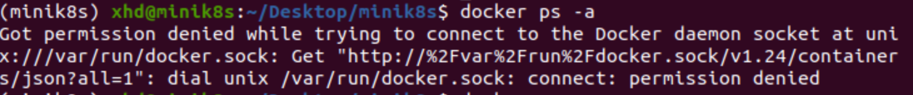
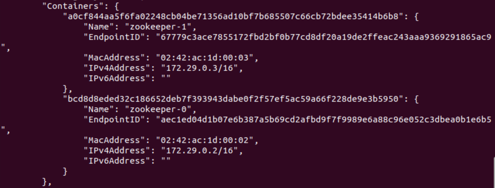
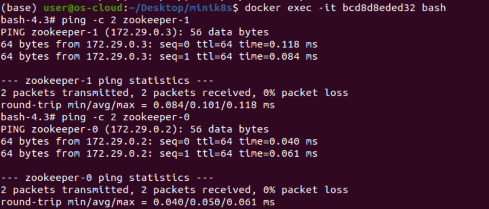
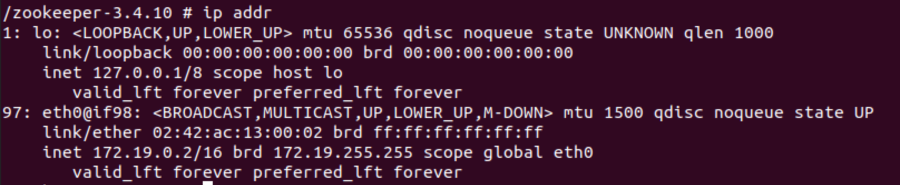
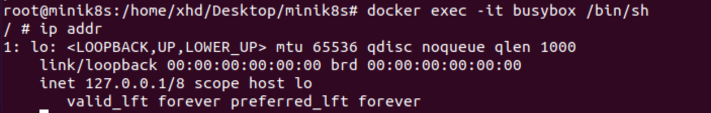

# K8S 的网络

要求：将 minik8s 部署到一台机器，可以管理另外两台机器。最后需要描述实际实现方式。

https://medium.com/@tao_66792/how-does-the-kubernetes-networking-work-part-1-5e2da2696701

用 K8S 的 CNI（Container Network Interface）插件来配置网桥的 IP。

## 基本知识

### Docker 网络模式

| 网络模式 | 简介 |
| :--: | :--: |
| bridge | 为每一个容器分配、设置 IP 等，并将容器连接到一个 `docker0` 虚拟网桥，默认为该模式 |
| host | 容器将不会虚拟出自己的网卡，配置自己的 IP 等，而是使用宿主机的 IP 和端口 |
| none | 容器有独立的 Network namespace，但并没有对其进行任何网络设置，如分配 veth pair 和网桥连接，IP 等 |
| container | 新创建的容器不会创建自己的网卡和配置自己的 IP，而是和一个指定的容器共享 IP、端口范围等 |

## 常用命令

### Docker

```bash
$ docker network create < network name > # 创建虚拟网桥
$ docker network ls # 查看所有虚拟网桥
$ docker network inspect < network name > # 查看某个网桥的详细信息
$ docker network prune # 将所有没用到的虚拟网桥删除
$ docker network rm < network name > # 删除某个虚拟网桥

$ docker ps -a # 查看所有运行中的容器
$ docker stop < container name 1> < container name 2> ...
$ docker rm < container name 1 > < constainer name 2> ...
```

### Conda

```bash
$ conda create -n < virtual env name > python=< version number> # 创建虚拟环境
$ conda remove -n < virtual env name > --all # 删除虚拟环境
$ conda activate < virtual env name > # 激活虚拟环境
$ conda deactivate < virtual env name > # 退出虚拟环境 
$ conda install < python package >=< version number> # 使用 conda 安装包
$ pip install < python package >=<version number > # 使用 pip 安装包
```

### 其他

检查主机某个端口是否打开

```bash
$ nmap -p 80 example.com
$ telnet google.com 80
```

## 问题少年

1. 启动容器时报错。

> raise errors.APIError: 409 Client Error: Conflict ("b'Conflict. The container name "zookeeper-0" is already in use by container "6acddsfsdfcdscdssdcdsdscscdscdsfgdsfdsd". You have to remove (or rename) that container to be able to reuse that name.'")

```bash
$ docker ps -a # 查看所有容器
$ docker stop e3274a72e8d6 # 停止对应容器
$ docker rm e3274a72e8d6 # 移除对应 CONTAINER-ID 的容器
```

2. 使用 `docker network create xxx` 创建网桥时报错。

> Error response from daemon: could not find an available, non-overlapping Ipv4 address pool among the defaults to assign to the network.

关掉 VPN 即可。

3. 使用 `docker-py` 时找不到函数。

版本问题，建议将虚拟环境删除，重新配置。

```bash
$ conda create -n minik8s python=3.8
$ conda activate minik8s
$ pip install docker
```

4. 使用 `docker container attach alpine1` 监视网络是命令行挂起不执行。

使用 `docker exec -it [container-id] bash` 替代。

5. 试图将两个 zookeeper 运行在一个 container 中报错端口冲突。

使用 `docker ps -a` 查看到后面那个 `zookeeper` 状态已经是 `Exit`，用 `docker log <container name>` 查看到是端口冲突。

注意理解 `yaml` 文件中 `port` 的含义是 container 内部的端口映射，因此这个 container 跑在哪个端口其实是默认的（比如对于 zookeeper 就是跑在 2181 端口）。

6. 运行 `docker ps -a` 时发现权限不够。



应该是其他进程锁住了 `/var/run/docker.sock` 文件。

```bash
$ sudo chmod 777 /var/run/docker.sock
```


## Pod 内的两个容器通信。Container-to-Container。

Pod 内部的容器应该是 **共享网络** 的，基于 `localhost`。

所以 **通过让两个 Container 共享一个 Network 命名空间，可以构成同一个 IP 地址，两个 Container 不使用相同端口**。

**并且引入一个专用的容器 pause 为 Pod 中的其他容器提供网络，相当于将网络解耦出来，自己实现时不需要考虑 pause。**

### 代码实现

#### 版本1 `2022.4.20`

在 `Pod` 类 `__init__` 函数中创建虚拟网卡，目前网卡的 `name` 还是写死的。

```Python3
networkname = "zookeeper-net"
backend.networks.create(networkname, driver="bridge")

for containercfg in containercfgs:
	backend.containers.run(..., network=networkname)
```

然后，我们根据 [docker 网桥配置教程](https://docs.docker.com/network/network-tutorial-standalone/) 来验证两个 `container` 的连通性。

```bash
$ docker container ls # 查看运行中的容器
```


```bash
$ docker network ls # 查看可用的网卡
```


```bash
$ docker network inspect zookeeper-net # 查看某张网卡的资源
```




因为他们定义在同一个网卡上，所以可以互相通信。

```bash
$ docker exec -it [container-id] bash
> ping -c 2 zookeeper-1
```



**BUG：注意，在绑定端口的 `_parse_ports_` 函数中应该根据下面的格式，对转换进行改动。**


#### 版本2 `2022.5.1`

我们不妨用 `busybox` 来充当 `pause` 容器，每次创建 Pod 时先运行一个 `pause` 名字的容器（需要在后面加一个哈希值以防重名）。

坑：不要用 `auto_remove` 字段，可能会出问题。

```Python
self._network = self._client.networks.create(name=self._namespace, driver="bridge")
self._client.containers.run(image='busybox', name='pause', detach=True, auto_remove=True, command=['sh', 'c', 'echo Hello World && sleep 3600'], network=self._network.name)
```

```yaml
kind: pod
name: example-pod
metadata:
	namespace: pod-network
containers:
	- image: zookeeper:3.4.10
		name: zookeeper
		command:
		resource:
			memory: 1g
			cpu: 1
	- image: busybox
		name: busybox
		command: ['sh', '-c', 'sleep 3600']
		resource:
			memory: 1g
			cpu: 1
```

我们先进入到 `zookeeper` 容器中查看网络，发现虚拟地址是 `172.19.0.2` 使用了 `98` 号实际网卡。

```bash
$ docker exec -it zookeeper /bin/sh
```



然后同样进入到 `busybox` 容器中查看网络，发现虚拟地址也是 `172.19.0.2` 使用了 `98` 号实际网卡。

```bash
$ docker exec -it busybox /bin/sh
```


同时，我们不要忘记了最初创建这个 Pod 时用的 `pause` 容器，让我们查看一下他的网络，发现这三者共用了一个 `ip` 地址，也就说明了他们在同一个网络命名空间下，可以进行 `localhost` 访问。

```bash
$ docker exec -it pause /bin/sh
$ ip addr
```


为了进一步验证，我们查看一下网桥的信息，发现 `pod-network` 正是我们刚刚创建出来的，而且下面挂载的确实只有 `pause` 容器，方便之后 pod-to-pod 之间的通信。

```bash
$ docker network ls
```


```bash
$ docker network inspect pod-network
```


我们还可以将 `pause` 容器停止来观察 `zookeeper` 容器和 `busybox` 容器的网络状态，发现确实少了 `eth0` 的虚拟网卡。~~我们可以用 `docker restart pause` 重启 `pause` 容器，发现 `eth0` 又回来了，这样就说明 `zookeeper` 容器和 `busybox` 容器确实是加入了 `pause` 的网络命名空间中。~~

```bash
$ docker stop pause
$ docker exec -it busybox /bin/sh
$ ip addr
```




## 同一个 Node 内部的两个 Pod 通信。Pod-to-Pod。

**Pod 之间可以直接通信（通过 Pod 的 IP），即 Pod 的 IP 是全局唯一的。**

## 跨 Node 的两个 Pod 通信。Pod-to-Service

打通 router/gateway 和网桥，即进行全局的 IP 分配，全局的 router/gateway 需要记录对应的路由信息。

## External-to-Service

由 kube-proxy 管理，依赖于云服务商或者是外部的一些实例（比如外部的 LB）来连接外部和内部的服务。


