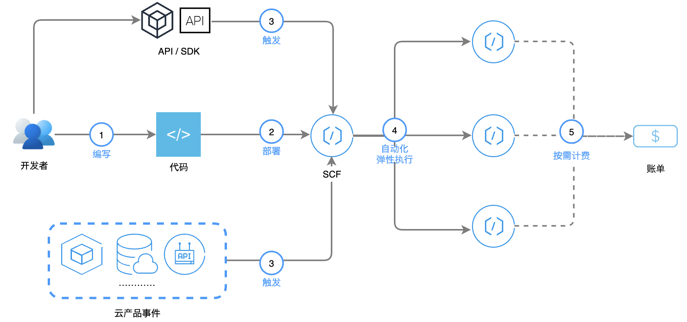
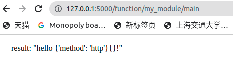
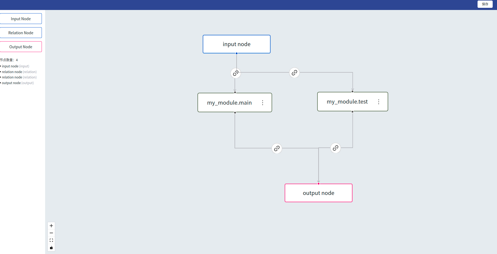

# Serverless文档


## Serverless简介

​	什么叫Serverless呢？Serverless可以认为就是FaaS（Function as a Service），也就是云服务商向开发者屏蔽了底层的实现细节，如物理机器、OS、平台等细节，开发者直接通过上传脚本的方式来直接部署服务，由云服务商来管理、控制自动扩展、进行流量控制等。

​	无服务器（Serverless）不是表示没有服务器，而表示当您在使用 Serverless 时，您无需关心底层资源，也无需登录服务器和优化服务器，只需关注最核心的代码片段，即可跳过复杂的、繁琐的基本工作。核心的代码片段完全由事件或者请求触发，平台根据请求自动平行调整服务资源。Serverless 拥有近乎无限的扩容能力，空闲时，不运行任何资源。代码运行无状态，可以轻易实现快速迭代、极速部署。

​	如下是腾讯云云函数的一个基本架构，我们可以看到其中最核心的就是SCF（Serverless Cloud Function），然后这个定义的云函数有两种触发方式

1. 用户通过API主动触发，我们可以认为是通过kubectl进行主动调用。
2. 云产品事件主动触发，比如说定期触发、满足某些条件触发等。这个通常是Serverless的高阶功能，我们不需要实现。



​	为了实现Function的抽象，我们的解决方案如下：

### 第一个思路（废弃）

​	既然我们需要调用python脚本，我们把用户定义的脚本挂载进一个`只有PYTHON环境的空ubuntu镜像`不就行了？我们只需要在dockerfile中添加一行即可

```dockerfile
CMD ["python3","/my_module.py"]
```

​	运行完后，我们把返回值输出到文件中，然后关闭容器即可。这个方案是完全可行的。主要可以参考这个网站，可以很容易地把脚本抄过来实现。[自动创建docker容器并启动python脚本](https://qa.1r1g.com/sf/ask/1800231401/)

问题：

- 当用户每次要调用函数的时候，我们都需要启动一个新的容器（构建出来的镜像是cache住的，所以不需要反复构建），这在minik8s Lab文档中定义为“冷启动”，效率比较低，不符合15的要求。

  

## 第二个思路（目前实现，助教推荐）

首先提供和助教的聊天记录，便于大家理解。

| 我：助教您好 请问serverless的逻辑是 用户请求过来了以后被API Server接住，然后API Server调用如下的脚本去动态地创建出容器 并且执行脚本，然后把函数运行结果从挂载的共享文件夹中拿出来还给用户吗？ 这似乎是一个可行的方案 但是似乎做不到所谓的毫秒级扩容和启动，启动容器感觉很花时间 而且我看市面上的serverless需要支持很多事件驱动，我这里只支持了用户主动调用 这看起来也符合我们的minik8s的要求 这是可以的是嘛？ |
| ------------------------------------------------------------ |
| 助教：不需要毫秒级扩容和启动，你这个可以支持第一个容器的启动，但是你要能满足这个要求所以你的容器是一次性的吗？就全部都是冷启动？ |
| 我：我目前是这样设计的 这样参数可以直接提前挂载到对应位置，否则就似乎需要事件机制了。需要通知运行中的容器有一个新的请求过来。 |
| 助教：其实不需要事件机制，你只需要add一个route，让容器做一个server，请求来了以后route到这个server。 |
| 我：就是说参数的传递和返回全部通过http的request和response实现嘛？这似乎听起来比起用挂载文件夹传递靠谱很多。<br>但是对于需要计算很久的程序来说，http的timeout就很难处理了吧？<br/>使用文件的话，哪怕它算了一小时才出结果，出了结果以后监测容器有没有被关掉。如果关掉了，我就从挂载的临时文件夹中读数据返回。 |
| 助教：serverless函数运行时间一般比较短，可以不考虑HTTP timeout。<br/>真正的serverless平台一般是，以openwhisk为例，如果运行时间真的很长，就在timeout之前先返回一个id。<br/>函数算完以后把结果存到数据库里面，用户可以通过id查询结果。不过这次不要求这么复杂。 |

​	既然助教提供了一种Best Practise，那我也不纠结了，直接实现就行了，和API Server一样，我们直接使用Python Flask作为后端，接收API Server转发过来的kubectl的请求。

​	首先，我们先看看用户定义的函数格式，函数格式和[腾讯云云函数](https://cloud.tencent.com/document/product/583/55593)的格式一致：

```python
# my_module.py
def my_function(event: dict, context: dict)->dict:
    return {"result": "hello {}{}!".format(event, context)}
```

Python 环境下的传入的参数包括 event 和 context，两者均为字典类型。

- event：使用此参数传递触发事件数据。
- context：使用此参数向您的处理程序传递运行时信息。

返回值也是一个字典类型，其result字段描述了真正的返回值。

​	接下来就是Serverless Server的构建，每当一个请求到达API Server，如果API Server发现没有运行着的Serverless Server实例，那么就通过dockerfile创建一个新的实例；如果发现有运行着的实例，就把http请求转发过去。Serverless Server的代码如下：

```python
# serverless_server.py
from flask import Flask, request
import importlib

app = Flask(__name__)

@app.route('/function/<string:module_name>/<string:function_name>', methods=['POST'])
def execute_function(module_name: str, function_name: str):
    module = importlib.import_module(module_name) # 动态导入当前目录下的名字为modul_name的模块
    event = {"method": "http"}	# 设置触发器参数，我们当前默认都是http触发
    context = request.form.to_dict()	# 把POST中的form的参数转化为字典形式作为函数的参数
    result = eval("module.{}".format(function_name))(event, context)
    # eval函数就是执行对应的指令，此处就是动态执行module模块下名为function_name的函数，并且把两个参数传入得到返回值放到result中
    return result, 200	# 把result放在http response中返回

if __name__ == '__main__':
    app.run(host='0.0.0.0', port=5000, processes=True)
```

​	serverless_server.py的代码是固定不变的 。接下来是，我们需要根据用户传入的my_module.py进行封装dockerfile，使用dockerfile构建image，Dockerfile的示例如下：

```dockerfile
FROM ubuntu
MAINTAINER xxx <user@example.org>

# update ubuntu repository
RUN DEBIAN_FRONTEND=noninteractive apt-get -y update

# install ubuntu packages
RUN DEBIAN_FRONTEND=noninteractive apt-get -y install python3 python3-pip

# 如果用户需要安装额外的库，那么还需要提供requirements.txt
# RUN pip install requirements.txt

# install python requirements
RUN pip install flask

# 把两个文件添加到image中，这样就不需要挂载了
ADD ./serverless_server.py serverless_server.py
ADD ./my_module.py my_module.py

# define command for this image
CMD ["python3","/serverless_server.py"]
```

我们使用如下指令进行构建镜像：

```bash
docker build -t serverless_test .
```

构建完之后，我们使用如下的指令来运行container(命令行阻塞模式)：

```bash
docker run -p 5000:5000 serverless_test
```

我们可以看到结果如下：

```bash
(base) baochen@baochen-Lenovo-Legion-Y7000-1060:~/Desktop/serverless_test$ docker run -p 5000:5000 serverless_test
 * Serving Flask app 'serverless_server' (lazy loading)
 * Environment: production
   WARNING: This is a development server. Do not use it in a production deployment.
   Use a production WSGI server instead.
 * Debug mode: off
 * Running on all addresses (0.0.0.0)
   WARNING: This is a development server. Do not use it in a production deployment.
 * Running on http://127.0.0.1:5000
 * Running on http://172.17.0.2:5000 (Press CTRL+C to quit)
```

我们在host主机输入`http://127.0.0.1:5000/function/my_module/my_function`进行访问，我们可以看到结果如下：



## Serverless DAG的支持


​	如果API Server中已经有了DAG，以及分支的转移条件，接下来做的事情无非就是API Server从开始节点一个个调用节点上定义的函数，然后根据边上的分支判断语句，去判断接下来运行哪个函数。如果我们单纯的使用txt去定义节点和边当然也是可以的，那这部分就毫无难度了。目前react前端如下，还在调试中。



可以在边上设定分支转移条件：

